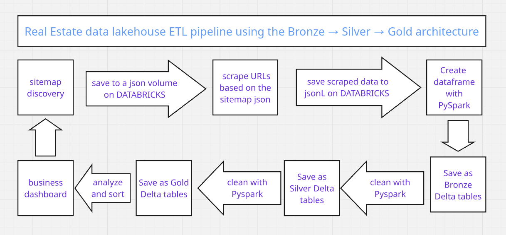

## Real Estate Data 
A web-scraping ETL pipeline implemented on Databricks using a lakehouse architecture and the Bronze/Silver/Gold medallion pattern. Configured for the website structure of imot.bg and currently set up to scrape houses for sale near Varna, Bulgaria.

## Dashboards: 
[Tableau Dashboards](https://public.tableau.com/app/profile/yoana.bastiyanova/vizzes)

## Setup: 
This is supposed to run on a serverless databricks notebook, just recreate the file structure and upload the scripts in code/. The notebook is available in root. The notebook blocks are supposed to be run in the order they were written. The scrapers work for imot.bg and the scrape criteria can be adapted in the "Run the imot.bg sitemap discovery" section. 

## Expected Databricks file locations

<pre>
  DATABRICKS
│
├── 📁 Workspace
│   └── 📓 [Databricks notebook]
│       
│
├── 🗄️ Catalog
│   └── workspace
│       └── default
│           └── Tables
│               ├── bronze_imot_listings
│               ├── bronze_imot_price_history
│               ├── silver_imot_listings
│               ├── silver_imot_price_history
│               ├── gold_agency_summary
│               ├── gold_market_by_location
│               └── gold_price_changes
│
└── 💾 Volumes
    └── /Volumes/workspace/default/real-estate/
        │
        ├── 📄 requirements.txt
        │
        ├── 📁 code/
        │   ├── imot_bg_sitemap_discovery.py
        │   ├── imot_bg_scraper.py
        │   └── imot_bg_test_fetch.py
        │
        ├── 📁 raw/
            ├── discovered_listing_urls.json
            ├── detail_snapshot.jsonl
            └── price_history.jsonl
        
</pre>
